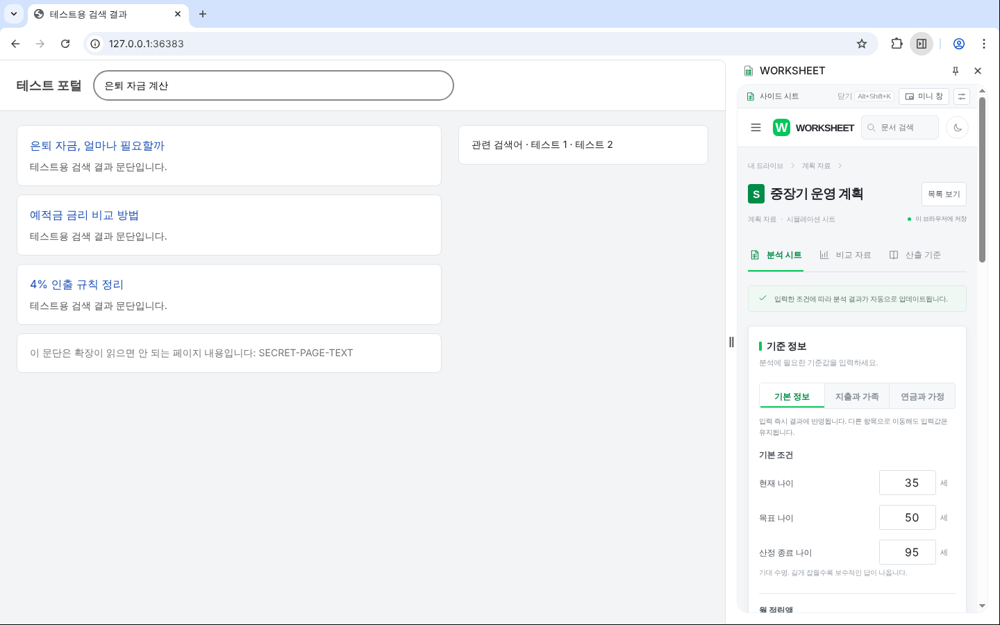
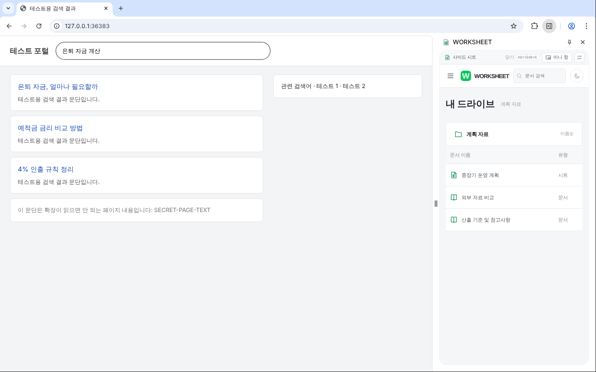
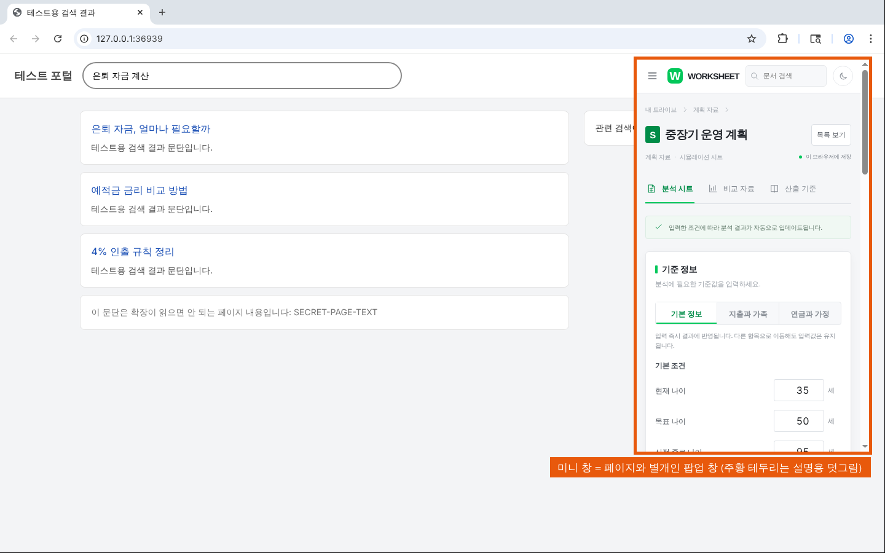

# WORKSHEET 사이드 시트 (overlay / side-car 확장)

보고 있는 **진짜 페이지는 전혀 건드리지 않고**, 브라우저 **옆 칸**(크롬·엣지의
side panel, 웨일의 sidebar)에 WORKSHEET 문서를 띄우는 Manifest V3 확장입니다.
웹 앱(`src/`)의 FIRE 계산기를 그대로 옆 칸에 싣고, 옆에 어떤 사이트를 띄워 두든
그 위가 아니라 그 **옆**에 나란히 둡니다.



## 게임 모드로 치면

게임 파일이나 메모리를 고치는 모드도, ReShade·Steam 오버레이처럼 게임의 그리기 과정에
끼어드는 모드도 **아닙니다**. 게임 옆에 따로 띄워 두는 **컴패니언 앱**(공략 지도·빌드
계산기를 세컨드 모니터에 띄우는 것)에 가깝습니다. 게임(남의 페이지)은 원본 그대로 돌고,
우리 화면은 브라우저가 내준 옆 칸이라는 **별도의 표면**에만 그려집니다. content script 가
아예 없어서 남의 페이지 DOM 에 손이 닿을 길이 없습니다.

## 들어 있는 것

| 파일 | 하는 일 |
| --- | --- |
| `manifest.ts` | 크롬용·웨일용 `manifest.json` 을 한곳에서 만든다(열쇠만 다름). |
| `src/background.ts` | 서비스 워커: 단추로 옆 칸 열기, 보스 키, 업무 탭 가져오기. |
| `sidepanel.html` + `src/sidepanel.ts` | 옆 칸 화면. 위 도구 막대(미니 창·설정) + 아래 WORKSHEET 앱. |
| `mini.html` + `src/mini.ts` | 미니 창(팝업 창 또는 문서 PiP 안의 틀) 안에서 도는 같은 앱. |
| `options.html` + `src/options.ts` | 설정: 보스 키 안내, 업무 탭(디코이) 주소. |
| `src/view-host.ts` | 옆 칸·미니 창이 같이 쓰는 앱 싣기 + 보스 키 받기. |
| `src/decoy.ts` | 업무 탭 주소 검사(https 만). |
| `src/protocol.ts` | 확장 안에서만 오가는 메시지·저장 키 약속. |
| `e2e.mjs` | 끝-끝 시험(아래 "시험"). |

## 보스 키 (몰컴의 핵심)

기본 단축키 **Alt+Shift+K**. 누르면 순서대로:

1. 열려 있는 옆 칸·미니 창의 수치를 **문서 목록으로 가린다**(`coverWorkspace()`).
   화면은 가린 즉시 **스스로 닫힌다**(`window.close()`).
2. 그래도 옆 칸이 남아 있으면 서비스 워커가 `chrome.sidePanel.close` 로 닫는다(대비책).
   이 호출은 **보통 브라우저 창에만** 한다 — 아래 "검증하며 고친 것" 참고.
   다음에 다시 열면 숫자가 아니라 **문서 목록부터** 보인다.
3. 설정에 **업무 탭 주소**를 적어 두었다면 그 탭을 새로 열거나(처음), 앞으로
   가져온다(다음부터). 기본값은 빈 값 = 아무것도 안 함.

옆 칸을 여는 단축키는 **Alt+Shift+S** 입니다(도구 막대 아이콘과 같은 일).
※ Alt+Shift+W 는 이 크로미움(리눅스 141)이 받아 주지 않아 S 로 두었습니다.



## 미니 창

도구 막대의 **미니 창** 단추는 작은 창을 따로 띄웁니다.

- 먼저 **문서 PiP**(`documentPictureInPicture.requestWindow`, 늘 위에 뜨는 창)를
  시도하고, 그 창 안에 `mini.html` 을 틀(iframe, 같은 확장이라 CSP `frame-src 'self'`
  허용)로 넣어 앱이 자기 문서를 갖게 합니다.
- 받은 PiP 창이 0.3초 뒤에도 **살아 있고 크기가 있는지** 확인합니다. 아니면 닫고
  **팝업 창**(`chrome.windows.create({type:'popup'})`, 추가 권한 없음)으로 띄웁니다.
- **실제 크롬(크로미움 141)의 옆 칸에서는 문서 PiP 가 쓸 수 없는 창을 돌려줍니다**
  (이유 없이 거절하거나, 크기 0 인 창을 돌려준 뒤 2~3ms 만에 닫음 — 실측). 그래서
  지금 크롬에서 사용자가 보게 되는 미니 창은 **팝업 창**이고, 팝업은 "늘 위에" 뜨지
  않습니다. 보통 탭에서는 PiP 가 380×640 으로 정상 동작하므로(e2e 가 확인), 옆 칸의
  PiP 를 허용하는 브라우저에서는 자동으로 PiP 를 씁니다.



## 빌드

루트 `node_modules` 에 vite·typescript·@types/chrome 가 이미 있습니다. 저장소 뿌리에서:

```bash
# 크롬·엣지용 → dist-mods/overlay-extension
npx vite build --config mods/overlay-extension/vite.config.ts

# 웨일용 → dist-mods/overlay-extension-whale
npx vite build --config mods/overlay-extension/vite.config.ts --mode whale

# 타입 검사
npx tsc --noEmit -p mods/overlay-extension/tsconfig.json

# 아이콘을 다시 만들 때(결과는 public/icons 에 들어 있음)
NODE_PATH=/opt/node22/lib/node_modules node mods/overlay-extension/scripts/make-icons.mjs
```

## 설치 / 실행

**크롬·엣지**: `chrome://extensions` → 개발자 모드 → "압축해제된 확장 프로그램을
로드" → `dist-mods/overlay-extension` 선택. 도구 막대의 아이콘을 누르면 옆 칸이
열립니다(또는 Alt+Shift+S).

**웨일**: `whale://extensions` → 개발자 모드 → `dist-mods/overlay-extension-whale`
선택. 사이드바 아이콘으로 엽니다.

단축키를 바꾸려면 `chrome://extensions/shortcuts`(설정 화면의 "단축키 바꾸기"
단추가 그 주소를 엽니다).

## 법적 가드레일 (지키는 것)

- **남의 페이지를 건드리지 않는다.** content script 가 **하나도 없다**. 남의 사이트를
  프록시·복제·재호스팅·리라이트하지 않고, 응답/보안 헤더(X-Frame-Options·CSP 등)를
  바꾸지 않으며(declarativeNetRequest·webRequest 권한 없음), 남의 페이지를 틀에 넣지
  않는다(CSP `frame-src 'self'` 로 브라우저가 막는다 — e2e 가 실제로 시도해 막히는 것을 확인).
- **읽지 않는다.** 탭의 주소·제목·내용·쿠키·입력값·방문 기록을 읽지 않는다.
  `tabs`·`activeTab`·`scripting`·`cookies`·`history` 권한이 없다. `web_accessible_resources`·
  `externally_connectable` 도 없어 남의 페이지가 이 확장 화면을 끼우거나 말을 걸 수 없다.
- **밖으로 나가는 연결은 공개 주소 하나뿐.** `host_permissions` 는 앱의
  `PUBLIC_ORIGIN`(예적금 공시 `/api/fire/products`) 하나이고, 확장 화면의 CSP 는
  `default-src 'self'`·`connect-src 'self' <공개 주소>`·`script-src 'self'` 로 그림·글꼴·
  스크립트까지 밖에서 싣지 못하게 묶었다. `<all_urls>` 를 쓰지 않는다. 원격 코드 없음.
- **최소 권한.** 권한은 `sidePanel`·`storage` 뿐(웨일은 `storage` 뿐).
  `chrome.tabs.create/update`·`chrome.windows.*` 는 권한 없이 쓰는 범위(열기·앞으로 가져오기·
  창 크기)만 쓴다.
- **상표를 쓰지 않는다.** 로고·이름·고유색을 흉내 내지 않고, 제품 이름은
  "WORKSHEET 사이드 시트". 화면·설명서·빌드 결과물 어디에도 네이버/NAVER 글자가 없다
  (e2e 가 두 변종의 결과물 전체를 검사). 아이콘은 범용 "표 문서" 그림.
- **데이터는 확장 저장소에만.** 입력값·테마는 확장 주소(`chrome-extension://…`)의
  localStorage, 업무 탭 주소는 `chrome.storage.local` 에만 남고, 보고 있는 페이지의
  저장소에는 닿지 않는다.

업무 탭(디코이) 주소는 보스 키를 눌렀을 때 **그 페이지로 이동**할 뿐입니다(평범한
네비게이션). 그 탭을 읽지 않습니다. 받는 주소는 `https` 로 좁히고, `javascript:`·`data:`·
`http:`·아이디·비번이 담긴 주소는 거절합니다.

## 검증하며 고친 것

- **보스 키가 브라우저를 죽이던 문제.** 예전 서비스 워커는 "지금 창"에 무조건
  `chrome.sidePanel.close` 를 불렀다. 미니 창(팝업)이 앞에 있을 때 보스 키를 누르면 그
  창 번호는 스스로 닫히는 중인 팝업이고, 크로미움 141 은 거기에 `sidePanel.close` 가
  닿으면 **브라우저 프로세스가 SIGSEGV 로 죽었다**(headless 반복 시험에서 약 열 번에 한 번).
  지금은 옆 칸이 실제로 열려 있을 때만, 보통 창에만 부른다. e2e 4g 가 미니 창 앞의 보스 키를
  10번 되풀이하고, 닫히는 팝업에는 `sidePanel.close` 를 부르지 않음을 확인한다.
- **실제 옆 칸에서 미니 창 단추가 대개 아무것도 안 띄우던 문제.** 위 "미니 창" 참고.
  예전 코드는 죽은 PiP 창을 성공으로 여겨 팝업으로 넘어가지 않았다. e2e 5 절이 Playwright
  없이 크로미움을 직접 띄워 실제 옆 칸의 단추를 진짜 마우스 입력으로 눌러 확인한다.
  (Playwright 는 새 창을 "디버거 대기"로 멈춰 세우는데, 옆 칸이 연 PiP 창은 옆 칸과 같은
  렌더러라 옆 칸까지 멈춘다. 예전 시험이 이것을 "PiP 가 멈춘다"로 잘못 읽었다.)
- `runtime.getContexts` 가 옆 칸의 `windowId` 를 `-1` 로 돌려준다(크로미움 141). 그래서
  "열린 창"은 알 수 없고, "열린 칸이 있는가"만 본다.

## 알려진 한계

- **웨일 빌드는 실행 검증하지 못했다**(컨테이너에 웨일 브라우저가 없음). 크로미움에서
  웨일 빌드의 설명서·결과물만 검사했다. `sidebar_action` 형식과 `whale.sidebarAction.hide`
  는 웨일 개발자 문서 기준이며, 웨일 사이드바에서 `window.close()`·문서 PiP 가 어떻게
  동작하는지, 설정 화면의 `chrome://extensions/shortcuts` 가 웨일에서 열리는지는 모른다.
- **지금 크롬에서 미니 창은 "늘 위에" 뜨지 않는다**(옆 칸 PiP 불가 → 보통 팝업 창).
- `chrome.sidePanel.close` 는 최근 크롬(141 무렵)에 들어온 API 다. 없는 버전(116~140)에서는
  화면이 `window.close()` 로 스스로 닫히고, e2e 가 그 대체 경로를 따로 확인한다.
- 단축키(commands)는 자동화로 누를 수 없어, 시험은 서비스 워커의 같은 처리
  (`self.worksheetBossKey`)를 직접 부른다. `worksheetBossKey`·`worksheetClosePanels` 는
  서비스 워커 전역에만 있고 페이지·다른 확장에서는 보이지 않는다.
- **예적금 공시**는 컨테이너가 공개 주소에 닿지 못해 시험에서 실패한다 — 앱이 터지지
  않고 오류 문구를 보여 주는지, 요청이 공개 주소로만 나갔는지만 확인한다.
- 합성 그림은 창 관리자가 없는 Xvfb 에서 찍어 팝업 창에 테두리·제목 줄이 없다.
  `composite-mini.png` 의 주황 테두리와 설명 띠는 그 자리를 알리려고 시험이 덧그린 것이다.
- 앱의 브랜드 색 토큰(`--ws-brand`)은 `src/` 의 기존 값을 그대로 쓴다(이 확장이 정한 색이 아님).

## 시험

```bash
# 두 변종을 먼저 빌드한 뒤(위 "빌드"), 저장소 뿌리에서.
# Xvfb(가상 화면)에서 돌리면 진짜 창으로 옆 칸이 열리고 합성 그림까지 담는다.
NODE_PATH=/opt/node22/lib/node_modules \
  xvfb-run -a -s "-screen 0 1440x900x24" node mods/overlay-extension/e2e.mjs

# 화면 없이(headless). 합성 그림과 PiP 크기 검사만 건너뛴다. 예전 합성 그림은 지우지 않는다.
NODE_PATH=/opt/node22/lib/node_modules node mods/overlay-extension/e2e.mjs
```

실패하면 0 이 아닌 값으로 끝납니다. 무엇을 보는지:

1. 설명서: 권한·host·CSP·content script 없음·두 변종 차이.
2. 빌드 결과물: 외부 주소는 공개 주소뿐, 쿠키·eval·요청 가로채기 API 없음, 네이버/NAVER 글자 없음.
3. 실제 옆 칸: 앱 그리기, 공시 실패 시 오류 문구, **옆 칸이 낸 요청이 공개 주소뿐(CDP 로 기록)**,
   CSP 가 포털 fetch·틀을 실제로 막음, 보스 키(가림·닫힘·다음에 목록부터·대체 경로·대비책),
   업무 탭(새로 열기→앞으로 가져오기), **포털 DOM·#secret-text 불변, 포털 서버가 받은 확장발 요청 0**.
4. 옆 칸 흉내 탭: 미니 창 PiP 길·팝업 길, 가린 상태, CSP 위반·오류 없음, 미니 창 앞 보스 키 10번.
5. 크로미움을 직접 띄운 실제 옆 칸에서 미니 창 단추 → 보이는 창, 보스 키 뒤 모두 닫힘.

화면은 `screenshots/` 에 저장됩니다.

| 파일 | 내용 |
| --- | --- |
| `composite-light.png` | 진짜 브라우저 창: 포털 페이지 + 옆 칸(밝은 화면, 입력부) |
| `composite-dark.png` | 같은 구성, 옆 칸 어두운 화면(결과 요약까지 내림) |
| `composite-covered.png` | 보스 키 뒤 다시 연 옆 칸이 문서 목록으로 시작 |
| `composite-mini.png` | 옆 칸을 닫고 미니 창(팝업)만 포털 위에 띄운 모습(덧그림 표시) |
| `panel-light.png` / `panel-dark.png` | 옆 칸 폭(400px) 화면 |
| `covered.png` | 가린 상태(문서 목록) |
| `mini-popup.png` | 팝업 미니 창 |
| `options.png` | 설정 화면 |
